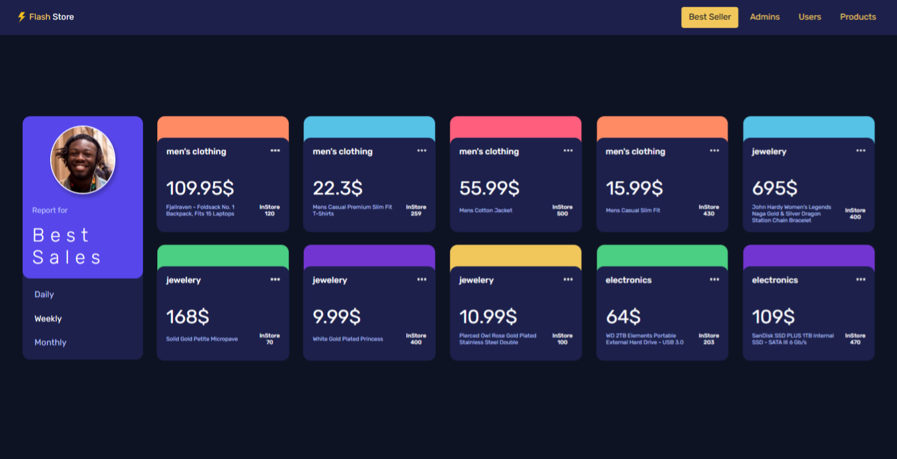
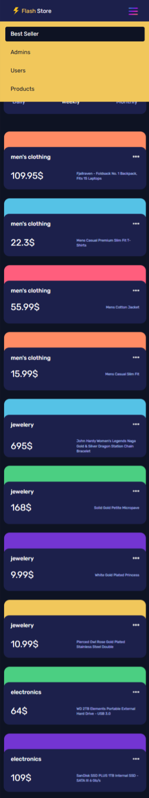

# Luftborn Task

This is the task for the front-end developer role at Luftborn company. Build as cards design using HTML, SCSS, and Angular 18.

## Table of contents

- [Overview](#overview)
  - [project Details](#Project-Details)
  - [Links](#links)
- [My process](#my-process)
  - [Built with](#built-with)
- [Author](#author)

## Overview

### Desktop

### Mobile

## Project Details

This project was generated with [Angular CLI](https://github.com/angular/angular-cli) version 18.1.2.

### Development server

Run `ng serve` for a dev server. Navigate to `http://localhost:4200/`. The application will automatically reload if you change any of the source files.

## Links

- Live Site URL : [Flash Store](https://luftborn-task-sandy.vercel.app/)

## My process

### Built with

- Angular
- Angular CLI
- SCSS
- TypeScript
- Animate.CSS

## Author

- Linkedin - [Mahmoud Sayed](https://www.linkedin.com/in/mahmoud-sayed-b85536217/)
- Codewars - [@MahmoudsMohammed](https://www.codewars.com/users/MahmoudsMohammed)
- Github - [MahmoudsMohammed](https://github.com/MahmoudsMohammed)
- Portfolio - [Mahmoud Sayed](https://mahmoudsmohammed.github.io/Mahmoud/)
